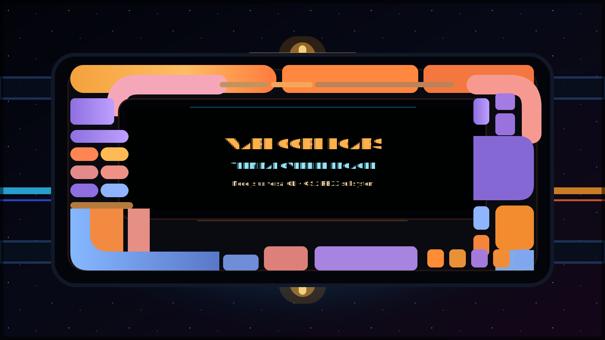

# 🖖 「上古科幻」Warp Core LCARS: The Universal Starfleet Interface

> "Computer, load OS/2 Warp VIO subsystem."
> The year is 1994, but your terminal is in the 24th Century.

**Warp-Core-LCARS** bridges IBM's legendary **OS/2 Warp** operating system, modern POSIX environments, and the **LCARS** (Library Computer Access/Retrieval System) interface from Star Trek.

Written in **REXX** for native OS/2 compatibility and using **Node.js** for modern systems, this is a terminal shell wrapper that runs across space and time.



## 🌌 Universal Operating System Compatibility

Warp-Core-LCARS uses a Cross-Dimensional Polyglot Architecture™: Node.js for modern systems and native REXX for legacy OS/2 systems.

| Operating System | Status | Subsystem / Engine |
| :--- | :---: | :--- |
| **Android** (Termux) | ✅ | Node.js Universal CLI |
| **FreeBSD** | ✅ | Node.js Universal CLI |
| **LCARS** (Starfleet Standard) | ✅ | Natively Integrated 🛸 |
| **Linux** | ✅ | Node.js Universal CLI |
| **macOS** | ✅ | Node.js Universal CLI |
| **OS/2 Warp** (3.0 / 4.0 / ArcaOS) | ✅ | Native VIO & REXX Scripts 💾 |
| **Windows** (WSL2 / PowerShell) | ✅ | Node.js Universal CLI |

## 📦 Installation for Modern Systems

Requirements:

- Node.js 18 or newer
- A terminal with ANSI color support

Install directly from GitHub:

```bash
npm install -g https://github.com/ahlimosa-gif/Warp-Core-LCARS/archive/refs/heads/main.tar.gz
```

Run the LCARS terminal renderer:

```bash
warpcore
```

## 🛠️ Local Development Install

Clone the repository, install the CLI globally from the working tree, then run it:

```bash
git clone https://github.com/ahlimosa-gif/Warp-Core-LCARS.git
cd Warp-Core-LCARS
npm install -g .
warpcore
```

You can also run the entrypoint without installing the CLI:

```bash
node test-router.js
npm start
```

## ✅ Smoke Test

Run the zero-dependency smoke test before packaging or publishing:

```bash
npm test
```

The smoke test verifies:

- `package.json` exposes `warpcore` through `bin`.
- `warpcore.cmd` contains only OS/2 REXX content, not Markdown wrapper text.
- `test-router.js` starts and prints the LCARS terminal banner.

## 🚀 npm Publishing

This repository is prepared for npm publishing, but the package is not currently published to the registry.

Before publishing, run:

```bash
npm test
npm run pack:dry-run
```

See [PUBLISHING.md](PUBLISHING.md) for the release checklist, 2FA notes, and versioning steps.

## 💾 Installation for OS/2 Warp

1. Download the `WARPCORE.ZIP` release file.
2. Unzip into your HPFS drive, for example `C:\LCARS`.
3. Open your OS/2 Warp command prompt and run:

```cmd
[C:\] cd LCARS
[C:\LCARS] pmrexx install.cmd
```

## 🧠 How It Works

- Modern POSIX and Windows environments run `test-router.js` through Node.js.
- The npm `bin` field exposes `test-router.js` as the `warpcore` command.
- OS/2 systems can use the REXX-oriented `install.cmd` and `warpcore.cmd` path.
